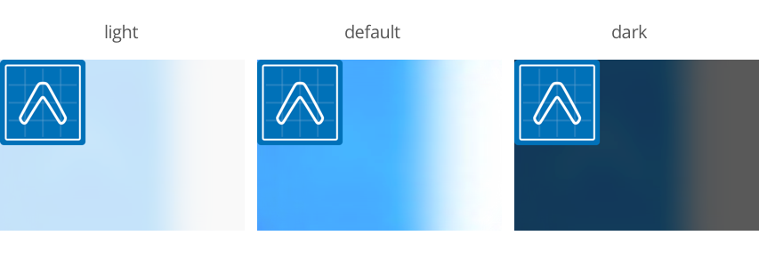

A React component that renders a native blur view on iOS and falls back to a semi-transparent view on Android. A common usage of this is for navigation bars and tab bars, like the following:


## Example: tintEffect



```javascript
import React from 'react';
import {
  AppRegistry,
  Image,
  StyleSheet,
  View,
} from 'react-native';
import {
  Components
} from 'exponent';

class BlurViewExample extends React.Component {
  render() {
    const uri = 'https://s3.amazonaws.com/exp-brand-assets/ExponentEmptyManifest_192.png';

    return (
      <View>
        <Image style={{width: 192, height: 192}} source={{uri}} />

        { /* Change tintEffect here to reproduce the above image */ }
        <Components.BlurView tintEffect="light" style={StyleSheet.absoluteFill}>
          <Image style={{width: 96, height: 96}} source={{uri}} />
        </Components.BlurView>
      </View>
    );
  }
}

AppRegistry.registerComponent('main', () => BlurViewExample);
```

### Example: blur strength with opacity

You can change `opacity` style on the component to change the strength of the blur.


```javascript
import React from 'react';
import {
  Animated,
  AppRegistry,
  Image,
  StyleSheet,
  View,
} from 'react-native';
import {
  Components,
} from 'exponent';

const AnimatedBlurView = Animated.createAnimatedComponent(Components.BlurView);

class BlurViewExample extends React.Component {
  state = {
    opacity: new Animated.Value(0),
  }

  componentDidMount() {
    this._animate();
  }

  _animate = () => {
    let { opacity } = this.state;
    Animated.timing(opacity, {duration: 2500, toValue: 1}).start((value) => {
      Animated.timing(opacity, {duration: 2500, toValue: 0}).start(this._animate);
    });
  }

  render() {
    const uri = 'https://s3.amazonaws.com/exp-brand-assets/ExponentEmptyManifest_192.png';

    return (
      <View style={{flex: 1, margin: 30}}>
        <View style={{flex: 1, padding: 55, paddingTop: 60}}>
          <Image style={{width: 180, height: 180}} source={{uri}} />

          <AnimatedBlurView
            tintEffect="default"
            style={[StyleSheet.absoluteFill, {opacity: this.state.opacity}]} />
        </View>
      </View>
    );
  }
}

AppRegistry.registerComponent('main', () => BlurViewExample);
```

## props

 `tintEffect`  
A string: `light`, `default`, or `dark`.
