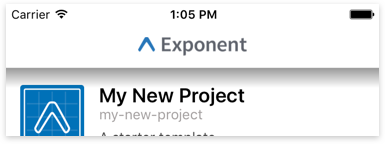

A React component that renders a native gradient view.

## Example button


    import React from 'react';
    import {
      Text,
      StyleSheet,
    } from 'react-native';
    import {
      Components
    } from 'exponent';


```javascript
export default class FacebookButton extends React.Component {
  render() {
    return (
      <Components.LinearGradient
        colors={['#4c669f', '#3b5998', '#192f6a']}
        style={{padding: 15, alignItems: 'center', borderRadius: 5}}>
        <Text style={{backgroundColor: 'transparent', fontSize: 15, color: '#fff'}}>
          Sign in with Facebook
        </Text>
      </Components.LinearGradient>
    );
  }
}
```

## Example with transparency


    import React from 'react';
    import { Components } from 'exponent';



```javascript
export default class BlackFade extends React.Component {
  render() {
    return (
      <Components.LinearGradient
        colors={['rgba(0,0,0,0.4)', 'transparent']}
        style={{position: 'absolute', left: 0, right: 0, top: 0, height: 20}} />
    );
  }
}
```

## props

 `colors`
An array of colors that represent stops in the gradient. At least two colors are required (otherwise it's not a gradient, it's just a fill!).

 
 `start`
An array of `[x, y]` where x and y are floats. They represent the position that the gradient starts at, as a fraction of the overall size of the gradient. For example, `[0.1, 0.1]` means that the gradient will start 10% from the top and 10% from the left.

 
 `end`
Same as start but for the end of the gradient.

 
 `locations`
An array of the same lenth as `colors`, where each element is a float with the same meaning as the `start` and `end` values, but instead they indicate where the color at that index should be.
