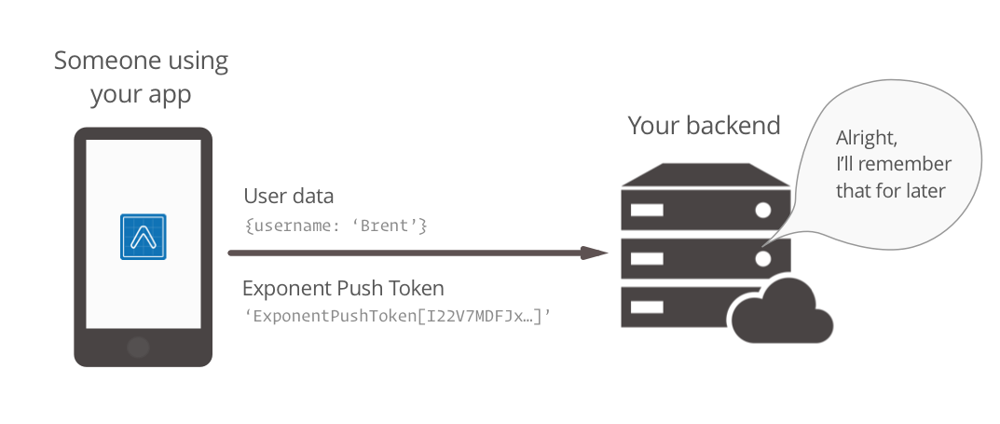
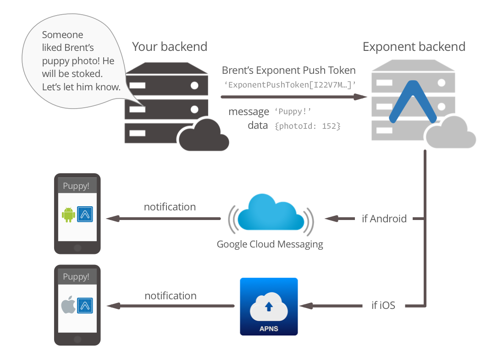
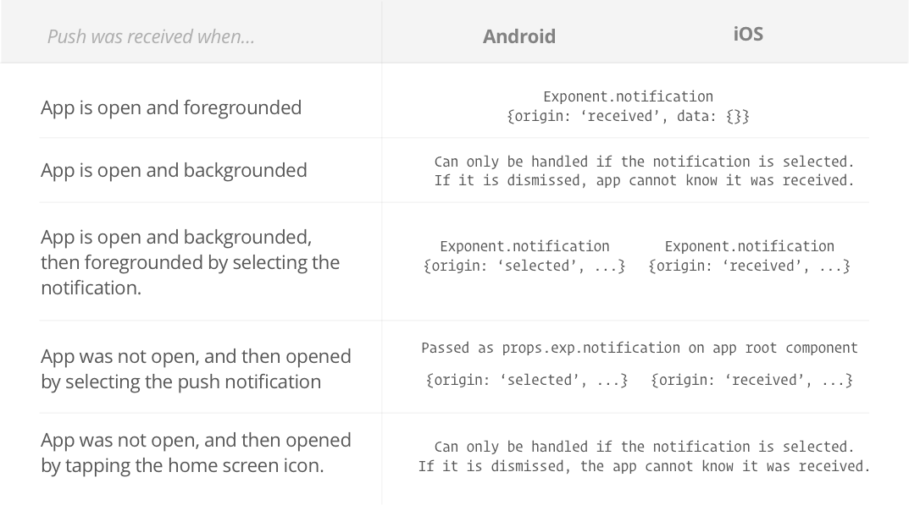

Push Notifications are an important feature to, as _"growth hackers"_ would say, retain and re-engage users and monetize on their attention, or something. From my point of view it's just super handy to know when a relevant event happens in an app so I can jump back into it and read more. Let's look at how to do this with Exponent. Spoiler alert: it's almost too easy.

> **Note:** iOS and Android simulators cannot receive push notifications, to test them out you will need to use a real-life device. Additionally, when calling Permissions.askAsync on the simulator, it will resolve immediately with "undetermined" as the status, regardless of whether you choose to allow or not.

There are three main steps to wiring up push notifications: sending a user's Exponent Push Token to your server, calling Exponent's Push API with the token when you want to send a notification, and responding to receiving and/or selecting the notification in your app (for example to jump to a particular screen that the notification refers to).

## 1. Save the user's Exponent Push Token on your server

In order to send a push notification to somebody, we need to know about their device. Sure, we know our user's account information, but Apple, Google, and Exponent do not understand what devices correspond to "Brent" in your propiertary user account system. Exponent takes care of identifying your device with Apple and Google through the Exponent push token, so all we need to do is send this to your server so you can associate it with the user account and use it in the future for sending push notifications.

```javascript
import { Permissions, Notifications } from 'exponent';

const PUSH_ENDPOINT = 'https://your-server.com/users/push-token';

async function registerForPushNotificationsAsync() {
  // Android remote notification permissions are granted during the app
  // install, so this will only ask on iOS
  let { status } = await Permissions.askAsync(Permissions.REMOTE_NOTIFICATIONS);

  // Stop here if the user did not grant permissions
  if (status !== 'granted') {
    return;
  }

  // Get the token that uniquely identifies this device
  let token = await Notifications.getExponentPushTokenAsync();

  // POST the token to our backend so we can use it to send pushes from there
  return fetch(PUSH_ENDPOINT, {
    method: 'POST',
    headers: {
      'Accept': 'application/json',
      'Content-Type': 'application/json',
    },
    body: JSON.stringify({
      token: {
        value: token,
       },
       user: {
        username: 'Brent',
       },
    }),
  });
}
```

## 2. Call Exponent's Push API with the user's token

Push notifications have to come from somewhere, and that somewhere is your server, probably (you could write a command line tool to send them if you wanted, it's all the same). When you're ready to send a push notification, grab the Exponent push token off of the user record and send it over to the Exponent API using a plain old HTTP POST request. We've taken care of wrapping that for you in a few languages:

-   [exponent-server-sdk-ruby](https://github.com/exponent/exponent-server-sdk-ruby)
-   [exponent-server-sdk-python](https://github.com/exponent/exponent-server-sdk-python)
-   [exponent-server-sdk-node](https://github.com/exponent/exponent-server-sdk-node)

Check out the source if you would like to implement it in another language. For the sake of demonstration, let's look at our [simple-rails-push-server-example](https://github.com/exponent/simple-rails-push-server-example).

```javascript
require 'exponent-server-sdk'

class TokensController < ApplicationController
  def create
    # You probably actually want to associate this with a user,
    # otherwise it's not particularly useful
    @token = Token.where(value: params[:token][:value]).first

    message = ''
    if @token.present?
      message = 'Welcome back!'
    else
      @token = Token.create(token_params)
      message = 'Welcome to Exponent'
    end

    exponent.publish(
      exponentPushToken: @token.value,
      message: message,
      data: {a: 'b'}, # Data is required, pass any arbitrary data to include with the notification
    )

    render json: {success: true}
  end

  private

  def token_params
    params.require(:token).permit(:value)
  end

  def exponent
    @exponent ||= Exponent::Push::Client.new
  end
end
```

## 3. Handle receiving and/or selecting the notification

For Android, this step is entirely optional -- if your notifications are purely informational and you have no desire to handle them when they are received or selected, you're already done. Notifications will appear in the system notification tray as you've come to expect, and tapping them will open/foreground the app.

For iOS, you would be wise to handle push notifications that are received while the app is foregrounded, because otherwise the user will never see them. Notifications that arrive while the app are foregrounded on iOS do not show up in the system notification list. A common solution is to just show the notification manually. For example, if you get a message on Messenger for iOS, have the app foregrounded, but do not have that conversation open, you will see the notification slide down from the top of the screen with a custom notification UI.

Thankfully, handling push notifications is straightforward with Exponent, all you need to do is add a listener to the `Notifications` object.

```javascript
import React from 'react';
import Exponent, {
  Notifications,
} from 'exponent';
import {
  Text,
  View,
} from 'react-native';

import registerForPushNotificationsAsync from 'registerForPushNotificationsAsync';

class AppContainer extends React.Component {
  state = {
    notification: {},
  };

  componentWillMount() {
    registerForPushNotificationsAsync();

    // Handle notifications that are received or selected while the app
    // is open. If the app was closed and then opened by tapping the
    // notification (rather than just tapping the app icon to open it),
    // this function will fire on the next tick after the app starts
    // with the notification data.
    this._notificationSubscription = Notifications.addListener(this._handleNotification);
  }

  _handleNotification = (notification) => {
    this.setState({notification: notification});
  };

  render() {
    return (
      <View style={{flex: 1, justifyContent: 'center', alignItems: 'center'}}>
        <Text>Origin: {this.state.notification.origin}</Text>
        <Text>Data: {JSON.stringify(this.state.notification.data)}</Text>
      </View>
    );
  }
}

Exponent.registerRootComponent(AppContainer);
```

### Notification handling timing

It's not entirely clear from the above when your app will be able to handle the notification depending on it's state at the time the notification is received. For clarification, see the following table:


