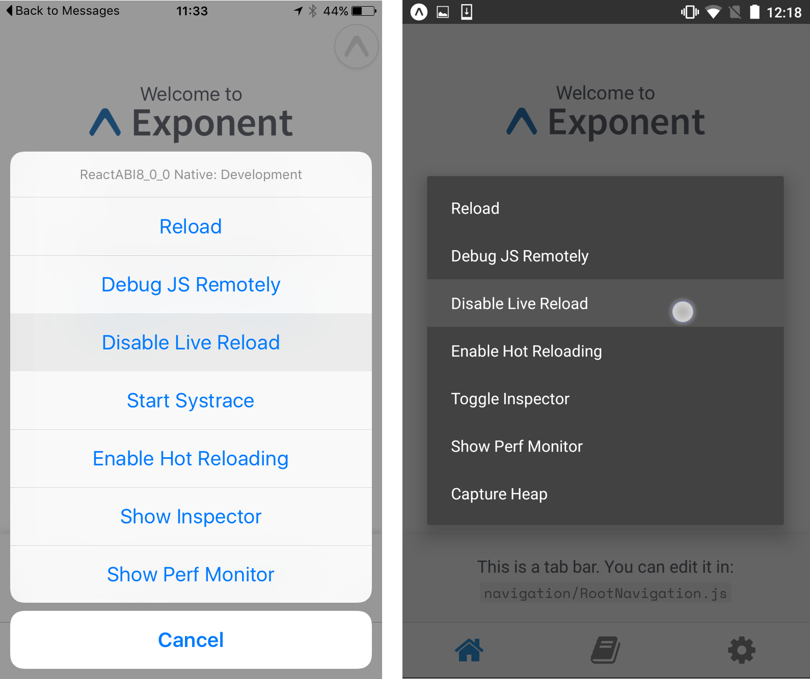
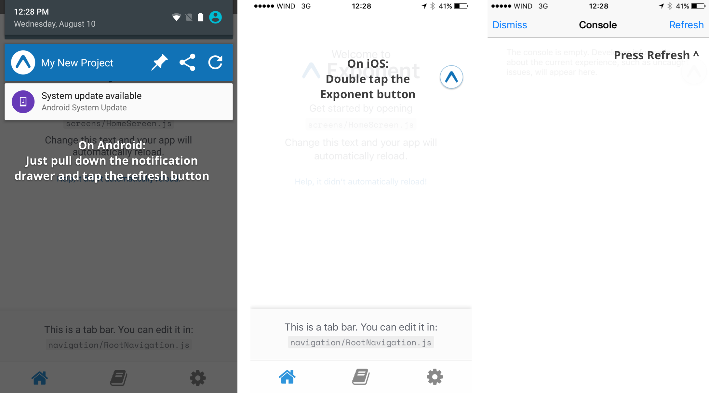

The aim of this first guide is to get an Exponent application up and running as quickly as possible.

At this point we should have XDE installed on our development machine and the Exponent client on an iOS or Android physical device or emulator. If not, go back to the [Installation](../introduction/installation.html) guide before proceeding.

Alright, let's get started.

## Create an account

Upon opening XDE you will be prompted for a username and password. Fill this in with your desired username and password and hit continue -- if the username isn't already taken, then we will automatically create the account for you.

## Creating the project

Press `Project` and select `New Project`, then choose the `Tab Navigation` option since that will give us a good starting point, then enter the name of your project in the dialog that pops up. I'll call mine `first-project`, and press create.

Next, choose where to save the project. I keep all of my fun projects in `~/coding`, so I navigate to that directory and press open.

XDE is now initializing a new project in selected directory: it copies a basic template and installs `react`, `react-native` and `exponent`.

When the project is initialized and ready to go you will see the message "React packager ready" in the XDE logs.

The "React packager" is a simple HTTP server that compiles our app JavaScript code using [Babel](https://babeljs.io/) and serves it to the Exponent app.

> **Note:** If you are on MacOS and XDE gets stuck on "Waiting for packager and tunnel to start", you may need to [install watchman on your machine](https://facebook.github.io/watchman/docs/install.html#build-install). The easiest way to do this is with [Homebrew](http://brew.sh/), `brew install watchman`.

## Open the app on your phone or simulator

You'll see that XDE shows you a URL like `http://4v-9wa.notbrent.mynewproject.exp.direct:80`- feel free to open this up in your browser, you will see that it serves up some JSON. This JSON is the Exponent manifest. We can open our app by opening the Exponent app on our phone typing this URL into the address bar. Alternatively, press `Send Link`, enter your phone number, and press `Send Link` again. Open the message on your phone and tap on the link to open it in Exponent. You can share this link with anybody else who has the Exponent app installed, but it will only be available as long as you have the project open in XDE.

To open the app in the iOS simulator you can press the `Device` button and choose `Open on iOS Simulator` (macOS only). To open the app in the Android emulator, first boot it up and then press `Device` and `Open on Android`.

## Making your first change

Open up `screens/HomeScreen.js` in your new project and change any of the text in the `render()` function. You should see your app reload with your changes.

### Can't see your changes?

Live reload is enabled by default, but let's just make sure we go over the steps to enable it in case somehow things just aren't working.

-   First, make sure you have [development mode enabled in XDE](development-mode.html#development-mode).

-   Next, close the app and reopen it.

-   Once the app is open again, shake your device to reveal the developer menu. If you are using an emulator, press `⌘+d` for iOS or `ctrl+m` for Android.

-   If you see `Enable Live Reload`, press it and your app will reload. If you see `Disable Live Reload` then exit the developer menu and try making another change.

    

#### Manually reloading the app

-   If you've followed the above steps and live reload **still** doesn't work, press the button in the bottom right of XDE to send us a support request. Until we resolve the issue for you, you can either shake the device and press `Reload`, or use one of the following tools which work both with an without development mode.

    

#### Congratulations

You have created a new Exponent project, made a change, and seen it update.

#### Next Steps

-   The [Additional Resources](../introduction/additional-resources.html#additional-resources) page has links to several open-source Exponent projects so you can see some working examples.
-   Read about the [Exponent SDK](../sdk/index.html#exponent-sdk) to learn about some useful APIs we provide out of the box.
-   Read some of our other guides, such as how to implement [Push Notifications](push-notifications.html#push-notifications), how we can take care of [Assets](preloading-and-caching-assets.html#all-about-assets) for you, or how to build [Standalone Apps](building-standalone-apps.html#building-standalone-apps) you can submit to Apple or Google.
-   Join us on Slack to get your questions answered.
