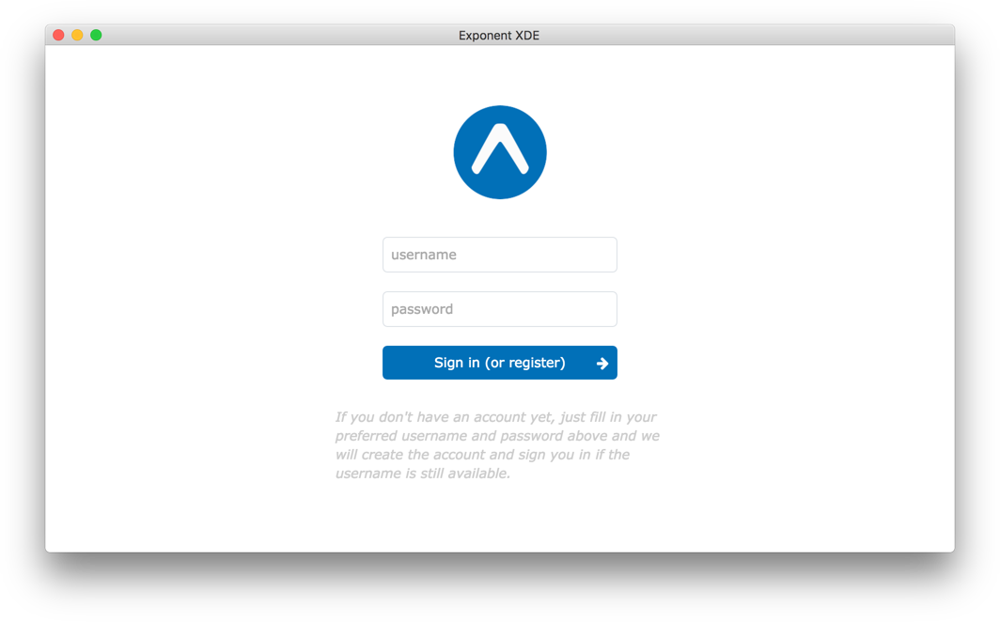
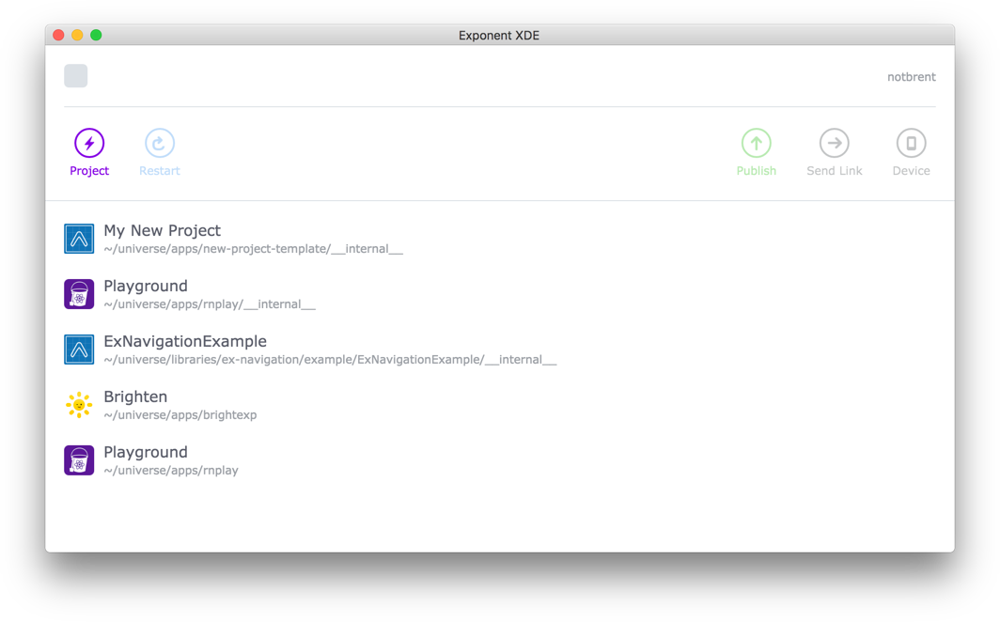
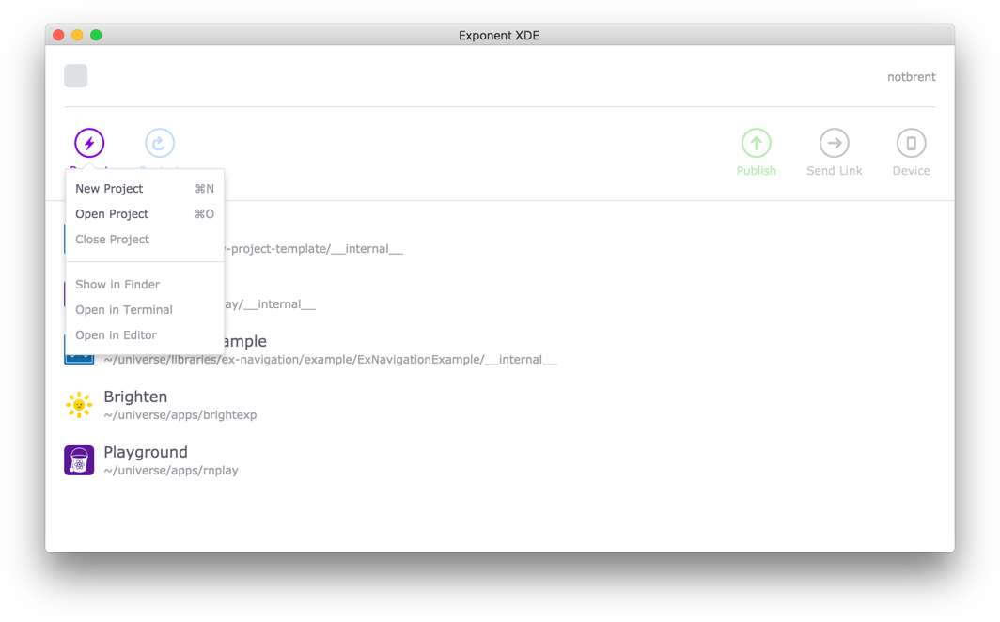
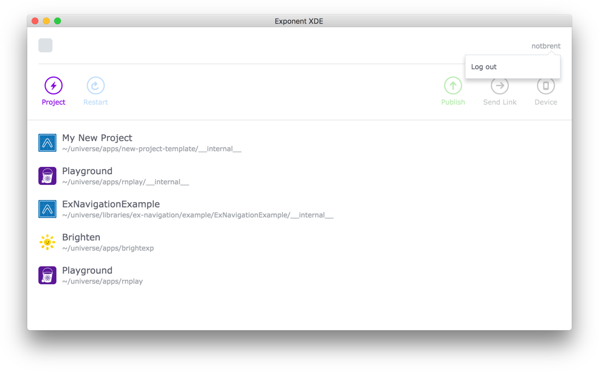
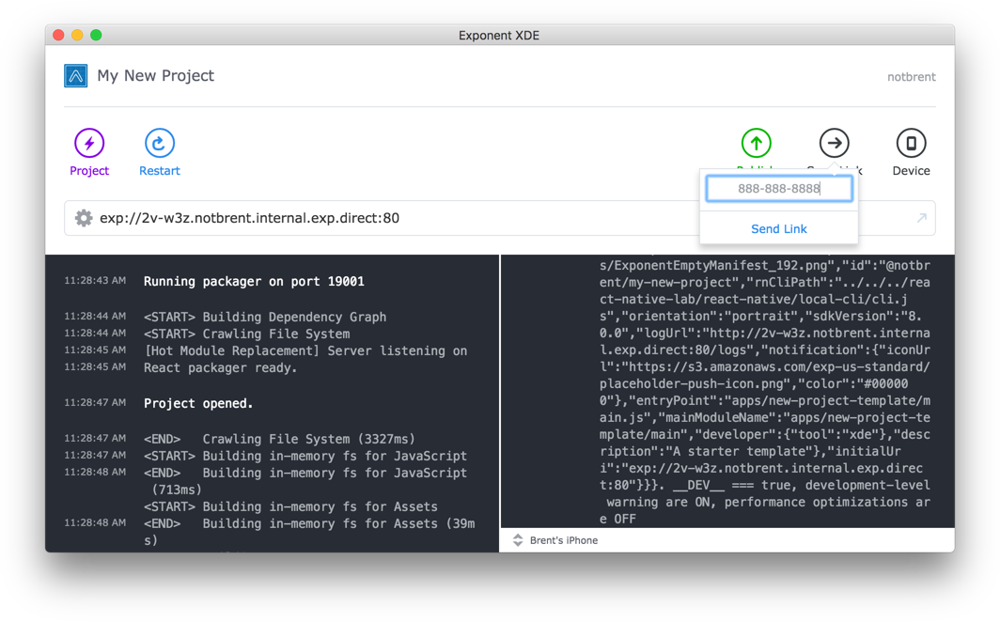
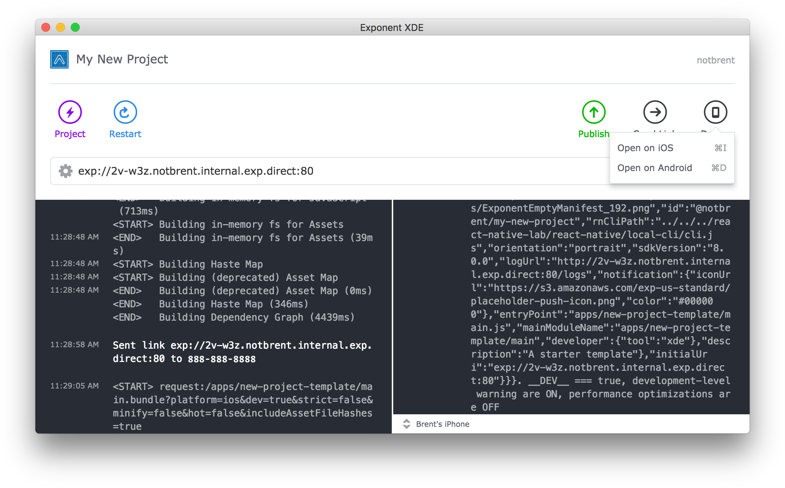
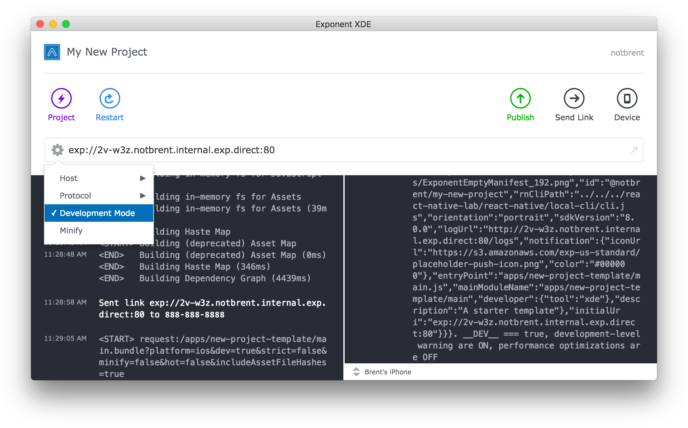
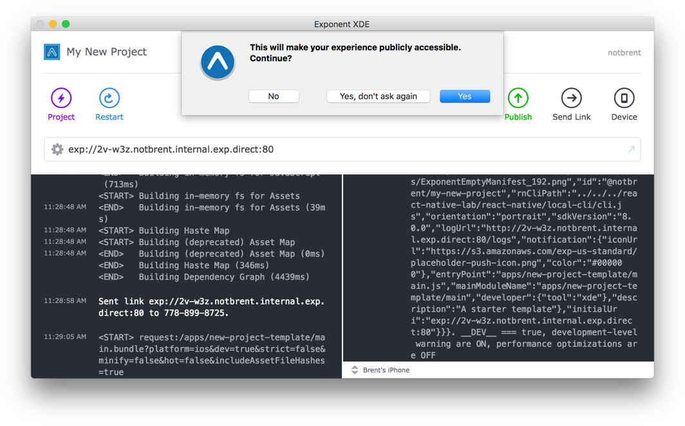

## Sign in screen

When you open XDE for the first time you'll be greeted by this sign in screen. If you have an account already, go ahead and sign in. If you don't, fill out your desired username and password and sign in. If the username is available, we'll create the account for you.

## Home screen

Success, you're logged in! From this screen you may want to create a new project or open an existing one. We list some of your most recently opened projects for convenience.

## Project dialog

Click on Project and you'll see everything you can do from here. Naturally you cannot close a project or show it in finder, etc, because you don't have one opened yet.

## Sign out, if you want

At any time you can click on your username in the top right and sign out. Or log out. Who can really agree on the verbiage?

## Project screen

So we've opened up a new project. The left pane is the React Packager, which you can learn more about in [Up and Running](/versions/v12.0.0/guides/up-and-running#up-and-running) and in [How Exponent Works](/versions/v12.0.0/guides/how-exponent-works#how-exponent-works). The right pane is for device logs, which you can read more about in [Viewing Logs](/versions/v12.0.0/guides/logging#logging).

## Send link

Send a link to your app to anybody with an internet connection. This is also useful for getting the link on your device if you don't have it connected to your computer.

## Opening on a device

The device button lets you quickly open your app on a device or simulator. Read more in [Up and Running](/versions/v12.0.0/guides/up-and-running#up-and-running).

## Development mode

You'll often want to work on your project in development mode. This makes it run a bit more slowly because it adds a lot of runtime validations of your code to warn you of potential problems, but it also gives you access to live reloading, hot reloading, remote debugging and the element inspector. Disable Development Mode and reload your app if you want to test anything related to performance.

## Project dialog (with project open)

In addition to the options provided from the home screen, with a project opened we give you access to a few shortcuts like showing the project directory in finder.

## Publish

When you hit publish you'll be asked to confirm that you want your project to be available to the public. Hitting yes will upload all of your assets and your apps JavaScript to our servers so that users can access it at any time from `exp.host/@your-username/your-app-slug`. More on what slug means in [Configuration with exp.json](/versions/v12.0.0/guides/configuration#exp), and more details about how publishing work in [How Exponent Works](/versions/v12.0.0/guides/how-exponent-works#how-exponent-works).
