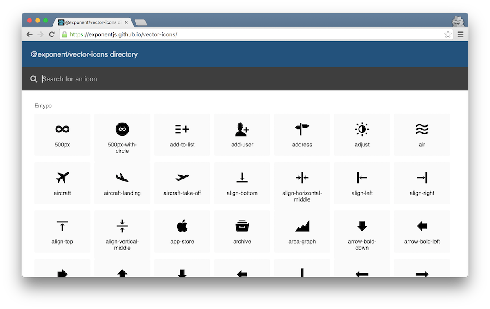

As trendy as it is these days, not every app has to use emoji for all icons 😳 -- maybe you want to pull in a popular set through an icon font like FontAwesome, Glyphicons or Ionicons, or you just use some PNGs that you carefully picked out on [The Noun Project](https://thenounproject.com/) (Exponent does not currently support SVGs). Let's look at how to do both of these approaches.

## @exponent/vector-icons

This library is installed by default on the template project that you create through XDE. (If you're adding it to an existing project, you'll need to follow the special instructions in [Existing Projects](#for-existing-projects) below). It includes eight icon sets, you can browse all of the icons using the [@exponent/vector-icons directory](https://exponent.github.io/vector-icons/).



```javascript
import React from 'react';
import { Ionicons } from '@exponent/vector-icons';

export default class IconExample extends React.Component {
  render() {
    return (
      <Ionicons name="md-checkmark-circle" size={32} color="green" />
    );
  }
}
```

This component loads the Ionicons font if it hasn't been loaded already, and renders a checkmark icon that I found through the vector-icons directory mentioned above. `@exponent/vector-icons` is built on top of [react-native-vector-icons](https://github.com/oblador/react-native-vector-icons) and uses a similar API. The only difference is `@exponent/vector-icons` uses a more idiomatic `import` style:

`import { Ionicons } from '@exponent/vector-icons';` instead of.. `import Ionicons from 'react-native-vector-icons/Ionicons';`.

> **Note:** As with [any custom font](../.html#using-custom-fonts) in Exponent, you may want to preload icon fonts before rendering your app. The font object is available as a static property on the font component, so in the case above it is `Ionicons.font`, which evaluates to `{ionicons: require('path/to/ionicons.ttf')}`. [Read more about preloading assets](../.html#all-about-assets).

## Existing Projects

`@exponent/vector-icons` uses .ttf fonts as assets. When you add this library to an existing Experience, you'll need to make sure the following package option appears in your exp.json:

```javascript
// exp.json
"packagerOpts": {
  "assetExts": ["ttf"]
}
```

## Custom Icon Fonts

First, make sure you import your custom icon font. [Read more about loading custom fonts](../.html#using-custom-fonts). Once your font has loaded, you'll need to create an Icon Set. `@exponent/vector-icons` exposes three methods to help you create an icon set.

### createIconSet

Returns your own custom font based on the `glyphMap` where the key is the icon name and the value is either a UTF-8 character or it's character code. `fontFamily` is the name of the font **NOT** the filename. See [react-native-vector-icons](https://github.com/oblador/react-native-vector-icons/blob/master/README.md#custom-fonts) for more details.

```javascript
import { Font } from 'exponent';
import { createIconSet } from '@exponent/vector-icons';
const glyphMap = { 'icon-name': 1234, test: '∆' };
const CustomIcon = createIconSet(glyphMap, 'FontName');

export default class CustomIconExample extends React.Component {
  state = {
    fontLoaded: false
  }
  async componentDidMount() {
    await Font.loadAsync({
      'FontName': require('assets/fonts/custom-icon-font.ttf')
    });

    this.setState({fontLoaded: true});
  }
  render() {
    if (!this.state.fontLoaded) { return null;}

    return (
      <CustomIcon name="icon-name" size={32} color="red" />
    );
  }
}
```

### createIconSetFromFontello

Convenience method to create a custom font based on a [Fontello](http://fontello.com/) config file. Don't forget to import the font as described above and drop the `config.json` somewhere convenient in your project, using `Font.loadAsync`.

```javascript
// Once your custom font has been loaded...
import { createIconSetFromFontello } from '@exponent/vector-icons';
import fontelloConfig from './config.json';
const Icon = createIconSetFromFontello(fontelloConfig, 'FontName');
```

### createIconSetFromIcoMoon

Convenience method to create a custom font based on an [IcoMoon](https://icomoon.io/) config file. Don't forget to import the font as described above and drop the `config.json` somewhere convenient in your project, using `Font.loadAsync`.

```javascript
// Once your custom font has been loaded...
import { createIconSetFromIcoMoon } from '@exponent/vector-icons';
import icoMoonConfig from './config.json';
const Icon = createIconSetFromIcoMoon(icoMoonConfig, 'FontName');
```

## Icon images

If you know how to use the react-native `<Image>` component this will be a breeze.

```javascript
import React from 'react';
import { Image } from 'react-native';

export default class SlackIcon extends React.Component {
  render() {
    return (
      <Image
        source={require('../assets/images/slack-icon.png')}
        fadeDuration={0}
        style={{width: 20, height: 20}}
      />
    );
  }
}
```

Let's assume that our `SlackIcon` class is located in `my-project/components/SlackIcon.js`, and our icon images are in `my-project/assets/images`, in order to refer to the image we use require and include the relative path. You can provide versions of your icon at various pixel densities and the appropriate image will be automatically used for you. In this example, we actually have `slack-icon@2x.png` and `slack-icon@3x.png`, so if I view this on an iPhone 6s the image I will see is `slack-icon@3x.png`. More on this in the [Images guide in the react-native documentation](https://facebook.github.io/react-native/docs/images.html#static-image-resources).

We also set the `fadeDuration` (an Android specific property) to `0` because we usually want the icon to appear immediately rather than fade in over several hundred milliseconds.
