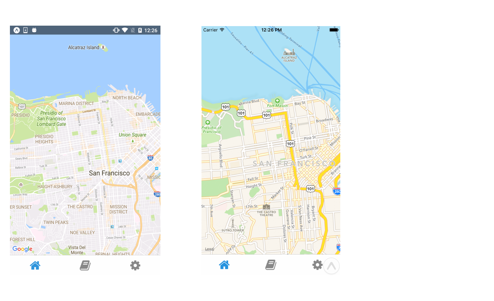

A Map component that uses Apple Maps on iOS and Google Maps on Android. Built by Airbnb at [airbnb/react-native-maps](https://github.com/airbnb/react-native-maps). No setup required for use within the Exponent app, or within a standalone app for iOS. See below for instructions on how to configure for deployment as a standalone app on Android.

> **Note:** It is currently not possible to use Google Maps on iOS despite being supported upstream in react-native-maps. We may add this feature if there is enough demand, let us know if you need it.



```javascript
import React from 'react';
import { Components } from 'exponent';

export default class HomeScreen extends React.Component {
  static route = {
    navigationBar: {
      visible: false,
    },
  }

  render() {
    return (
      <Components.MapView
        style={{flex: 1}}
        initialRegion={{
          latitude: 37.78825,
          longitude: -122.4324,
          latitudeDelta: 0.0922,
          longitudeDelta: 0.0421,
        }}
      />
    );
  }
}
```

### `Exponent.Components.MapView()`  
See full documentation at [airbnb/react-native-maps](https://github.com/airbnb/react-native-maps).

## Deploying to a standalone app on Android

If you have already integrated Google Sign In into your standalone app, this is very easy. Otherwise, there are some additional steps.

-   **If you already have Google Sign In configured**
    1.  Open your browser to the [Google API Manager](https://console.developers.google.com/apis).
    2.  Select your project and enable the **Google Maps Android API**
    3.  In `exp.json`, copy the API key from `android.config.googleSignIn` to `android.config.googleMaps.apiKey`.
    4.  Rebuild your standalone app.
-   **If you already have not configured Google Sign In**
    1.  Build your app, take note of your Android package name (eg: `ca.brentvatne.growlerprowler`)
    2.  Open your browser to the [Google API Manager](https://console.developers.google.com/apis) and create a project.
    3.  Once it's created, go to the project and enable the **Google Maps Android API**
    4.  Go back to <https://console.developers.google.com/apis/credentials> and click **Create Credentials**, then **API Key**.
    5.  In the modal that popped up, click **RESTRICT KEY**.
    6.  Choose the **Android apps** radio button under **Key restriction**.
    7.  Click the **+ Add package name and fingerprint** button.
    8.  Add your `android.package` from `exp.json` (eg: `ca.brentvatne.growlerprowler`) to the Package name field.
    9.  Run `keytool -list -printcert -jarfile growler.apk | grep SHA1 | awk '{ print $2 }'` where `growler.apk` is the path to the apk you built in step 1.
    10. Take the output from step 9 and insert it in the "SHA-1 certificate fingerprint" field.
    11. Copy the API key (the first text input on the page) into `exp.json` under the `android.config.googleMaps.apiKey` field. [See an example diff](https://github.com/brentvatne/growler-prowler/commit/3496e69b14adb21eb2025ef9e0719c2edbef2aa2).
    12. Press `Save` and then rebuild the app like in step 1.

## Deploying to a standalone app on iOS

No special configuration required.
