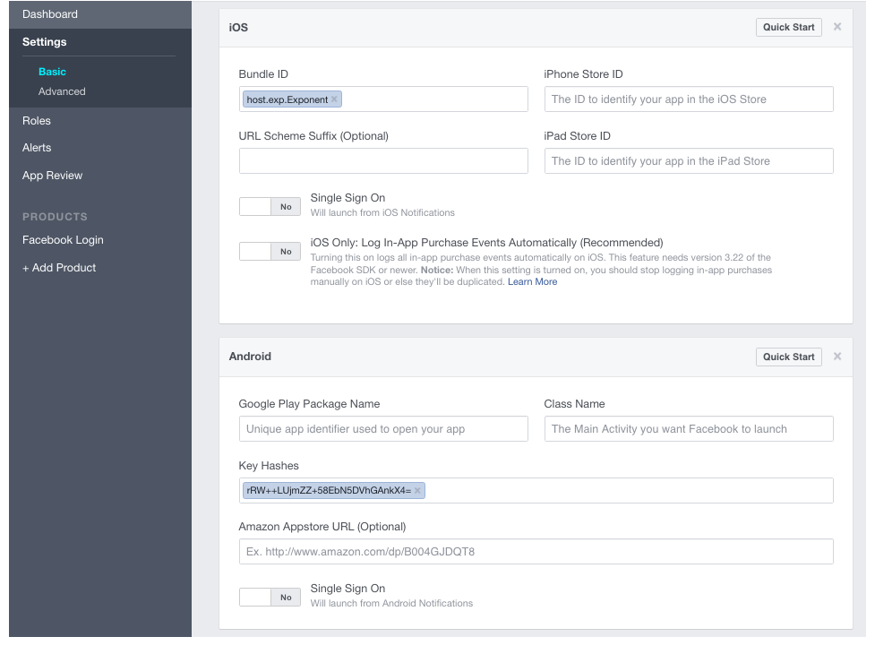

Provides Facebook integration for Exponent apps. Exponent exposes a minimal native API since you can access Facebook's [Graph API](https://developers.facebook.com/docs/graph-api) directly through HTTP (using [fetch](https://facebook.github.io/react-native/docs/network.html#fetch), for example).

Follow [Facebook's developer documentation](https://developers.facebook.com/docs/apps/register) to register an application with Facebook's API and get an application ID. For iOS, make sure to add host.exp.Exponent as a 'Bundle ID'. For Android add the key hash `rRW++LUjmZZ+58EbN5DVhGAnkX4=`. Your app's settings should end up including the following under "Settings > Basic":

You may have to switch the app from 'development mode' to 'public mode' before other users can log in.

### `Exponent.Facebook.logInWithReadPermissionsAsync(appId, options)`
Prompts the user to log into Facebook and grants your app permission  
to access their Facebook data.

#### param string appId
Your Facebook application ID. [Facebook's developer documentation](https://developers.facebook.com/docs/apps/register) describes how to get one.

#### param object options
A map of options:

* **permissions (_array_)** -- An array specifying the permissions to ask for from Facebook for this login. The permissions are strings as specified in the [Facebook API documentation](https://developers.facebook.com/docs/facebook-login/permissions). The default permissions are `['public_profile', 'email', 'user_friends']`.

returns  
If the user or Facebook cancelled the login, returns `{ type: 'cancel' }`.

Otherwise, returns `{ type: 'success', token, expires }`. `token` is a string giving the access token to use with Facebook HTTP API requests. `expires` is the time at which this token will expire, as seconds since epoch. You can save the access token using, say, `AsyncStorage`, and use it till the expiration time.

example  
    async function logIn() {
      const { type, token } = await Exponent.Facebook.logInWithReadPermissionsAsync(
        '&lt;APP_ID>', {
          permissions: ['public_profile'],
        });
      if (type === 'success') {
        // Get the user's name using Facebook's Graph API
        const response = await fetch(
          `https://graph.facebook.com/me?access_token=${token}`);
        Alert.alert(
          'Logged in!',
          `Hi ${(await response.json()).name}!`,
        );
      }
    }

Given a valid Facebook application ID in place of `<APP_ID>`, the code above will prompt the user to log into Facebook then display the user's name. This uses React Native's [fetch](https://facebook.github.io/react-native/docs/network.html#fetch) to query Facebook's [Graph API](https://developers.facebook.com/docs/graph-api).
