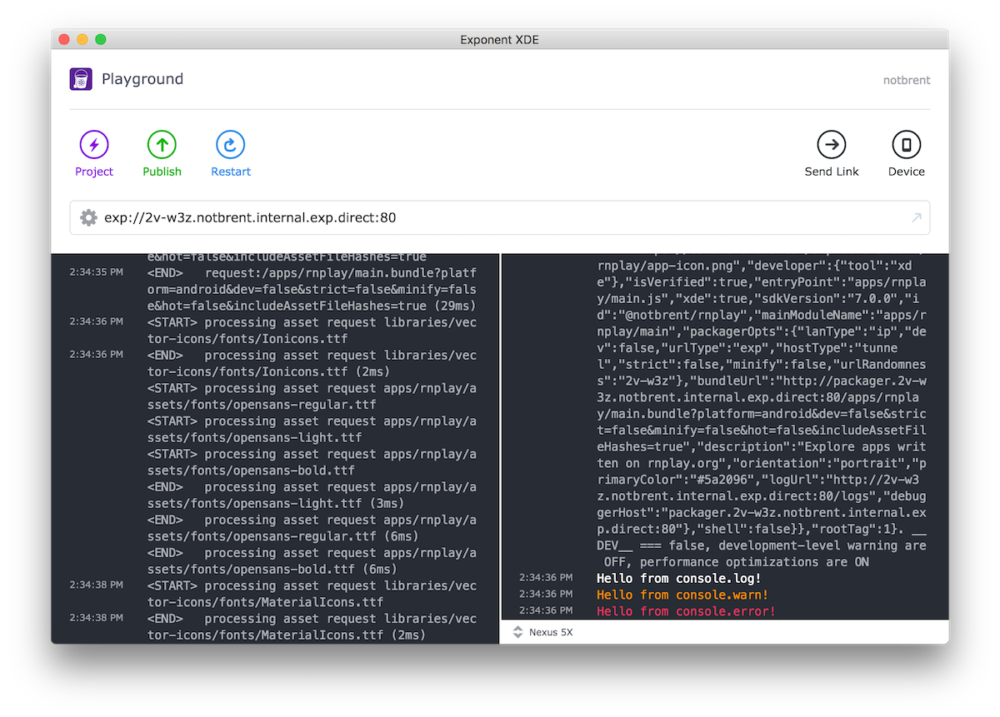
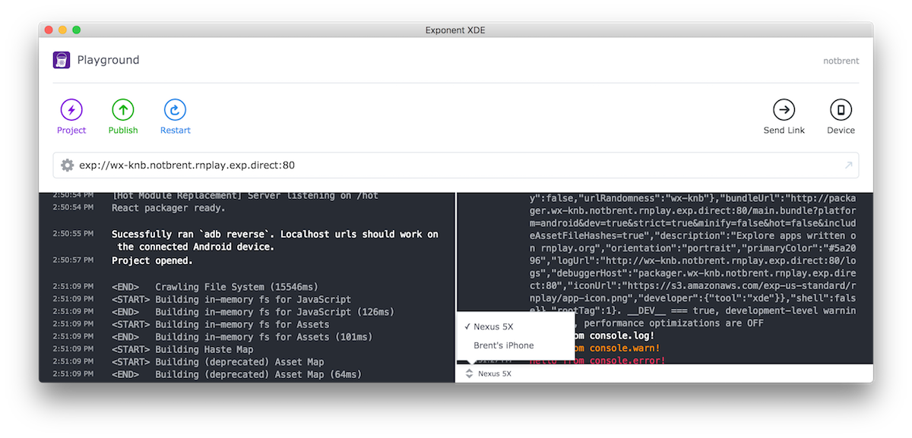

Writing to the logs in an Exponent app works just like in the browser: use `console.log`, `console.warn` and `console.error`. Note: we don't currently support `console.table` outside of remote debugging mode.

## Recommended: View logs with Exponent tools

When you open an app that is being served from XDE or exp, the app will send logs over to the server and make them conveniently available to you. This means that you don't need to even have your device connected to your computer to see the logs -- in fact, if someone opens the app from the other side of the world you can still see your app's logs from their device.

> **Note:** Are the logs not showing up for you? Be sure that you're using Exponent sdkVersion 7.0.0 or higher, and that you have the `exponent` npm package installed and imported (eg: `import * as Exponent from 'exponent'` at the top of your main JS file).

### XDE logging pane

With XDE you will notice that when you open up an app with sdkVersion >= 7.0.0 the log window is split in two. Your app logs show up on the right, and the packager logs show up on the left.

XDE also lets you switch between the logs for any device that has opened the app.

### exp logs

If you use our command line tool `exp`, you also have easy access to the logs with the `exp logs` command (be sure to have your server started first! `exp start` in the project directory).

Packager logs and app logs from all connected devices will be streamed to this screen until you exit with `CTRL+C`.

## Optional: Manually access device logs

While it's usually not necessary, if you want to see logs for everything happening on your device, even the logs from other apps and the OS itself, you can use one of the following approaches.

### View logs for an iOS simulator

#### Option 1: Use GUI log

-   In simulator, press `⌘ + /`, _or_ go to `Debug -> Open System Log` -- both of these open a log window that displays all of the logs from your device, including the logs from your Exponent app.

#### Option 2: Open it in terminal

-   Run `instruments -s devices`
-   Find the device / OS version that the simulator you are using, eg: `iPhone 6s (9.2) [5083E2F9-29B4-421C-BDB5-893952F2B780]`
-   The part in the brackets at the end is the device code, so you can now do this: `tail -f ~/Library/Logs/CoreSimulator/DEVICE_CODE/system.log`, eg: `tail -f ~/Library/Logs/CoreSimulator/5083E2F9-29B4-421C-BDB5-893952F2B780/system.log`

### View logs for your iPhone

-   `brew install libimobiledevice`
-   Plug your phone in
-   `idevicepair pair`
-   Press accept on your device
-   Run `idevicesyslog`

### View logs from Android device or emulator

-   Ensure Android SDK is installed
-   Ensure that [USB debugging is enabled on your device](https://developer.android.com/studio/run/device.html#device-developer-options) (not necessary for emulator).
-   Run `adb logcat`
