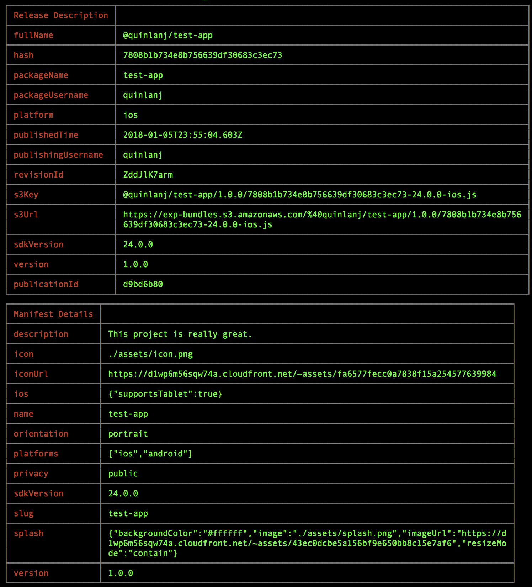

> **WARNING:** Channel features are in beta.

## Introduction

For a quick introduction to release channels, read [this] (https://docs.expo.io/versions/latest/guides/release-channels.html)

When you publish your app by running `exp publish --release-channel staging`, it creates:

- a release, identified by a `publicationId` for Android and iOS platforms
- a link to the release in the `staging` channel, identified by a `channelId`

For simplicity, the rest of this article will refer to just the `ios` releases.

## See Past Publishes
You can see everything that you’ve published with `publish:history`. 

#### Example command and output:
`$ exp publish:history --platform ios`

| publishedTime  | appVersion  | sdkVersion  | platform  | channel  | channelId  | publicationId  |
|---|---|---|---|---|---|---|
| 2018-01-05T23:55:04.603Z  |  1.0.0 | 24.0.0 |  ios | staging  | 9133d577  | d9bd6b80  |

To see more details about this particular release, you can run `publish:details`

#### Example command and output:
`$ exp publish:details --publish-id d9bd6b80`

[](/_images/release-channels-pub-details-1.png)


## What Version of the App Will My Users Get?

Your users will get the most recent compatible release that was pushed to a channel. Factors that affect compatibility:

- sdkVersion
- platform

## Promoting a Release to a New Channel

Usecase: You previously published a release and now you want this release to be in another channel (ie)  `prod`.

We run `publish:set` to push our release to the `prod` channel. 
`$ exp publish:set --publish-id d9bd6b80 --release-channel prod`

Continuing from the previous section, we can see that our release is available in both the `staging` and the `prod` channels.

`$ exp publish:history --platform ios`

| publishedTime  | appVersion  | sdkVersion  | platform  | channel  | channelId  | publicationId  |
|---|---|---|---|---|---|---|
| 2018-01-05T23:55:04.603Z  |  1.0.0 | 24.0.0 |  ios | staging  | 9133d577  | d9bd6b80  |
| 2018-01-05T23:55:04.603Z  |  1.0.0 | 24.0.0 |  ios | prod  | 6e406223  | d9bd6b80  |

## Rollback a Channel Entry 

Usecase: You published a release to a channel, and now you dont want it in the channel anymore.

Continuing from the previous section, we rollback our `prod` channel entry with `publish:rollback`.

`$ exp publish:rollback --channel-id 6e406223`

Now we can see that our release is no longer available in the prod channel.

`$ exp publish:history --platform ios`

| publishedTime  | appVersion  | sdkVersion  | platform  | channel  | channelId  | publicationId  |
|---|---|---|---|---|---|---|
| 2018-01-05T23:55:04.603Z  |  1.0.0 | 24.0.0 |  ios | staging  | 9133d577  | d9bd6b80  |

## Release Channels CLI Tools
### Publish History

```
  Usage: publish:history [--release-channel <channel-name>] [--count <number-of-logs>]
  
  View a log of your published releases.

  Options:
    -c, --release-channel <channel-name>  Filter by release channel. If this flag is not included, the most recent publications will be shown.
    -count, --count <number-of-logs>      Number of logs to view, maximum 100, default 5.
```

### Publish Details
```
  Usage: publish:details --publish-id <publish-id>
  View the details of a published release.

  Options:
    --publish-id <publish-id>  Publication id. (Required)
```

### Publish Rollback
```
Usage: publish:rollback --channel-id <channel-id>
  
  Rollback an update to a channel.

  Options:
    --channel-id <channel-id>  The channel id to rollback in the channel. (Required)
```

### Publish Set
```
 Usage: publish:set --release-channel <channel-name> --publish-id <publish-id>

  Set a published release to be served from a specified channel.

  Options:
    -c, --release-channel <channel-name>  The channel to set the published release. (Required)
    -p, --publish-id <publish-id>         The id of the published release to serve from the channel. (Required)
```