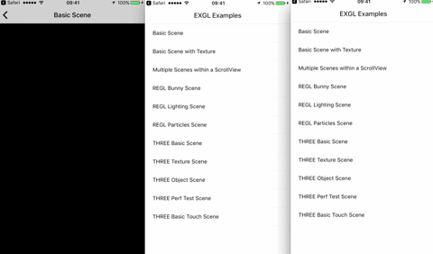

### `Expo.GLView()`

A `View` that acts as an OpenGL ES render target. On mounting, an OpenGL ES context is created. Its drawing buffer is presented as the contents of the `View` every frame.

Other than the regular `View` props for layout and touch handling, the following props are available:

 `onContextCreate`
A function that will be called when the OpenGL ES context is created. The function is passed a single argument [gl](#gl-object) that acts as an interface to the underlying OpenGL ES context.

 `msaaSamples`
`GLView` can enable iOS's built-in [multisampling](https://www.khronos.org/registry/OpenGL/extensions/APPLE/APPLE_framebuffer_multisample.txt). This prop specifies the number of samples to use. By default this is 4. Setting this to 0 turns off multisampling. On Android this is ignored.

## Examples

Here are a couple examples of the use of `GLView` on Sketch:

-   [Basic plain WebGL example](https://sketch.expo.io/SJaCWirsg)
-   [Rotating red box with THREE.js](https://sketch.expo.io/rkpPMg8ie)
-   [Game of Life with REGL](https://sketch.expo.io/HkjUrfIje)

The [@community/gl-test](https://expo.io/@community/gl-test) Expo app demonstrates a number of example scenes. The image below is a low-quality capture, try the app on Expo for the best-quality experience. The source code for these scenes is available [here](https://github.com/exponent/gl-test/tree/master/Scenes)

## The `gl` object

Once the component is mounted and the OpenGL ES context has been created, the gl object received through the [`onContextCreate`](#expoglviewoncontextcreate "Expo.GLView.onContextCreate") prop becomes the interface to the OpenGL ES context, providing a WebGL-like API. It resembles a [WebGLRenderingContext](https://www.khronos.org/registry/webgl/specs/latest/1.0/#5.14) in the WebGL 1 spec. An additional method `gl.endFrameEXP()` is present which notifies the context that the current frame is ready to be presented. This is similar to a 'swap buffers' API call in other OpenGL platforms.

The following WebGLRenderContext methods are currently unimplemented:

- Framebuffer
  - `framebufferRenderbuffer`
  - `getFramebufferAttachmentParameter`
- Renderbuffer
  - `bindRenderbuffer`
  - `createRenderbuffer`
  - `deleteRenderbuffer`
  - `getRenderbufferParameter`
  - `renderbufferStorage`
- Texture
  - `compressedTexImage2D`
  - `compressedTexSubImage2D`
  - `getTexParameter`
  - `texSubImage2D`
- Uniforms and Attributes
  - `getUniform`
  - `getVertexAttrib`
  - `getVertexAttribOffset`

`texImage2D` only supports the 9-argument form. The last argument must either be an ArrayBuffer with the texture data as in the WebGL spec, an `Expo.Asset` refering to an image to use as the source for the texture, or null. See [gl-test](https://github.com/exponent/gl-test/blob/deedfac1b7b6f9c9ce6e42a3b51700cf47da773c/Scenes/BasicTextureScene.js#L85-L88) for an example of using image assets as OpenGL textures.

For efficiency reasons the current implementations of the methods don't perform type or bounds checking on their arguments. So, passing invalid arguments could cause a native crash. We plan to update the API to perform argument checking in upcoming SDK versions. Currently the priority for error checking is low since engines generally don't rely on the OpenGL API to perform argument checking and, even otherwise, checks performed by the underlying OpenGL ES implementation are often sufficient.
